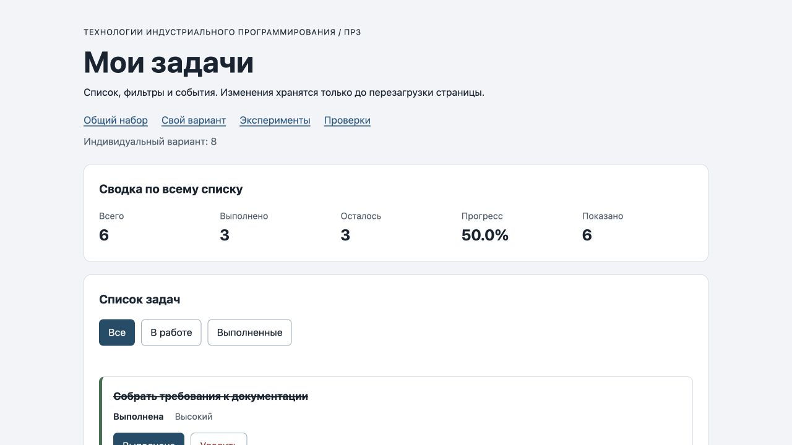

# Практическая работа № 3. Работа с DOM и событиями

## Данные работы

| Поле | Значение |
|---|---|
| Имя | Куницкий Алексей |
| Группа | ЭФБО-05-25 |
| Номер в журнале | 16 |
| Вариант из ПР2 | 8 |
| Node.js | `v25.2.1` |
| Браузер | Chromium 152.0.0.0 (Codex In-app Browser, фактический User-Agent) |
| Операционная система | macOS 26.6.2 (25G83) |

## Запуск

Рабочая папка — `practice-03` внутри личного репозитория:

```bash
npm run check:service
npm start
```

Зависимостей нет; `npm install` не требуется. После запуска доступны:

```text
http://127.0.0.1:5503/
http://127.0.0.1:5503/index.html?dataset=variant
http://127.0.0.1:5503/examples/dom-events.html
http://127.0.0.1:5503/checks.html
```

## Что перенесено из ПР2

`data.js` и проверенная реализация `task-service.js` перенесены из ПР2 без изменения контрактов. Номер и данные варианта сохранены. Повторный запуск сервисных проверок: `35` пройдено, `0` ошибок.

## Эксперименты

| № | До запуска: прогноз | После запуска: результат | Объяснение |
|---:|---|---|---|
| 1. Отсутствующий элемент и коллекция | `querySelector` вернёт `null`, коллекция будет иметь длину `0` | `null`; длина `0` | Одиночный поиск возвращает `null`, а `querySelectorAll` — пустой `NodeList`. У `null` нельзя читать свойства. |
| 2. `dataset` и числовой `id` | Значение `"23"` типа `string`; после `Number` — `23` типа `number` | `dataset.taskId: 23 string`; `Числовой id: 23` | Значения `data-*` читаются как строки и проверяются после явного преобразования. |
| 3. Статический `NodeList` | Старый список останется длиной 1, новый поиск покажет 3 | После двух добавлений: старый `NodeList` — 1; новый — 3 | `querySelectorAll` возвращает статическую коллекцию. |
| 4. Строка с HTML-разметкой | На странице появится буквальный текст, дочернего `strong` не будет | Заголовок: `<strong>Это текст, а не HTML</strong>` | Использован `textContent`, поэтому строка не разбирается как HTML. |
| 5. Распространение события | Захват контейнера, обработчик кнопки, всплытие контейнера | Фазы `1 → 3 → 3`; `target=lab-label`, `currentTarget=lab-card → lab-button → lab-card` | Нажат вложенный `span`; цель события постоянна, а текущий обработчик меняется. |

## Организация кода

- `task-service.js` содержит независимые операции над данными из ПР2.
- `task-selectors.js` формирует новый массив для фильтра `all`, `pending` или `completed`.
- `task-view.js` безопасно создаёт DOM-карточки и обновляет список, сводку и пустое состояние.
- `main.js` хранит `currentTasks` и `currentFilter`, один раз подписывает контейнеры на события, вызывает сервисы и запускает согласованную перерисовку.

Полная сводка всегда рассчитывается по `currentTasks`, а не по количеству видимых карточек.

## Общий сценарий

| Шаг | Видимые id | Всего | Выполнено | Осталось | Прогресс | Показано | Сообщение | Совпало |
|---:|---|---:|---:|---:|---:|---:|---|---|
| 0 | `[1, 4, 7, 10]` | 4 | 2 | 2 | `50.0%` | 4 | — | Да |
| 1 | `[4, 7]` | 4 | 2 | 2 | `50.0%` | 2 | — | Да |
| 2 | `[7]` | 4 | 3 | 1 | `75.0%` | 1 | — | Да |
| 3 | `[1, 4, 7, 10]` | 4 | 3 | 1 | `75.0%` | 4 | — | Да |
| 4 | `[1, 4, 10]` | 3 | 3 | 0 | `100.0%` | 3 | — | Да |
| 5 | `[]` | 3 | 3 | 0 | `100.0%` | 0 | Нет задач по выбранному фильтру. | Да |
| 6 | `[1, 4, 10]` | 3 | 2 | 1 | `66.7%` | 3 | — | Да |
| 7 | `[]` | 0 | 0 | 0 | `0.0%` | 0 | Список задач пуст. | Да |

После перезагрузки восстановился шаг 0: изменения хранятся только в памяти страницы.

## Индивидуальный вариант

Тема варианта 8 — оформление технической документации. Исходные шесть задач имеют `id` `[11, 23, 37, 41, 58, 64]`, первые три выполнены.

| Этап | Всего | Выполнено | Осталось | Прогресс | Видимые id |
|---|---:|---:|---:|---:|---|
| До действий | 6 | 3 | 3 | `50.0%` | `[11, 23, 37, 41, 58, 64]` |
| Исходный фильтр «В работе» | 6 | 3 | 3 | `50.0%` | `[41, 58, 64]` |
| Исходный фильтр «Выполненные» | 6 | 3 | 3 | `50.0%` | `[11, 23, 37]` |
| После переключения `23` | 6 | 2 | 4 | `33.3%` | `[11, 23, 37, 41, 58, 64]` |
| После удаления `37` | 5 | 1 | 4 | `20.0%` | `[11, 23, 41, 58, 64]` |
| Итог, фильтр «В работе» | 5 | 1 | 4 | `20.0%` | `[23, 41, 58, 64]` |
| Итог, фильтр «Выполненные» | 5 | 1 | 4 | `20.0%` | `[11]` |

## Протокол проверки сервиса

```text
Проверок пройдено: 35; не пройдено: 0.
```

Проверены модель ПР2, девять функций, ошибочные данные и отсутствие мутаций.

## Протокол браузерных проверок

Фактический итог страницы `checks.html`:

```text
Всего: 36. Пройдено: 36. Ошибок: 0.
```

Среди пройденных сценариев: три фильтра, безопасный вывод текста, повторный рендер, оба пустых состояния, клики по вложенным подписям, неизвестные `id` `777` и `4abc`, неизвестное действие, восстановление фокуса и восстановление исходных данных после перезагрузки.

## Собственные проверки

| № | Исходное состояние и действия | Ожидаемый результат | Фактический результат | Итог |
|---:|---|---|---|---|
| 1 | В фильтре «Выполненные» удалить `1` и `10` | Пустая выборка, но в полном массиве остаются `4` и `7`; сообщение о фильтре | `2 / 0 / 2 / 0.0%`, показано 0; «Нет задач по выбранному фильтру.» | Пройдено |
| 2 | В «В работе» выполнить `4`, перейти в «Все», вернуть `4`, снова открыть «В работе» | После первого действия виден `[7]`, в конце снова `[4, 7]` | Получены `[7]` и затем `[4, 7]`; сводка вернулась к `4 / 2 / 2 / 50.0%` | Пройдено |
| 3 | Удалить `7`, выполнить `4`, открыть «Выполненные», затем перезагрузить | До перезагрузки `[1, 4, 10]` и `100.0%`; после — исходные данные | Получено `3 / 3 / 0 / 100.0%`, после перезагрузки `4 / 2 / 2 / 50.0%` | Пройдено |

## Отладка и клавиатура

Для клика по вложенной подписи кнопки статуса фактические значения на границе обработчика: `event.target` — `span.action-label`, `event.currentTarget` — `ul#task-list`, `dataset.taskId` — строка `"4"`, после `Number` — число `4`, действие — `"toggle"`, найдена задача `id=4` с `completed=false`, сервис вернул `{ ok: true, tasks: ... }` с `completed=true`.

Автоматические проверки подтвердили отказ без изменения данных для `777` и `4abc`. Нажатие Enter переключило `id=4` и сохранило фокус на новой кнопке статуса; Space вернуло исходный статус и снова сохранило фокус. После удаления `id=7` клавишей Enter фокус перешёл на активный фильтр «Все».

Требуемую преподавателем визуальную остановку в DevTools нужно один раз выполнить вручную на строке чтения `card?.dataset.taskId`: среда автоматической проверки подтверждает значения и поведение, но не создаёт честный снимок панели DevTools.

## Вид приложения

Фактический вид индивидуального варианта после запуска:



## Дополнительное задание

Не выполнялось.

## Вывод

Реализован интерфейс списка задач с делегированием событий, фильтрами, сводкой и двумя видами пустого состояния. Изменения сначала создают новое состояние через сервис ПР2, затем DOM полностью согласуется с ним через `renderApp`; удаление элемента только из DOM не используется.

## Повторный запуск 06.10.2026

35 сервисных и 36 браузерных проверок прошли без ошибок. Вариант после переключения 23 и удаления 37 дал 5 / 1 / 4 / 20.0%. Enter и Space переключили статус 4 и сохранили фокус. Лабораторная страница подтвердила три фазы события и безопасный текст названия. Node.js: v25.2.1; macOS: 27.0 (26A428); браузер для ПР3: Chromium 153.0.8010.12.
