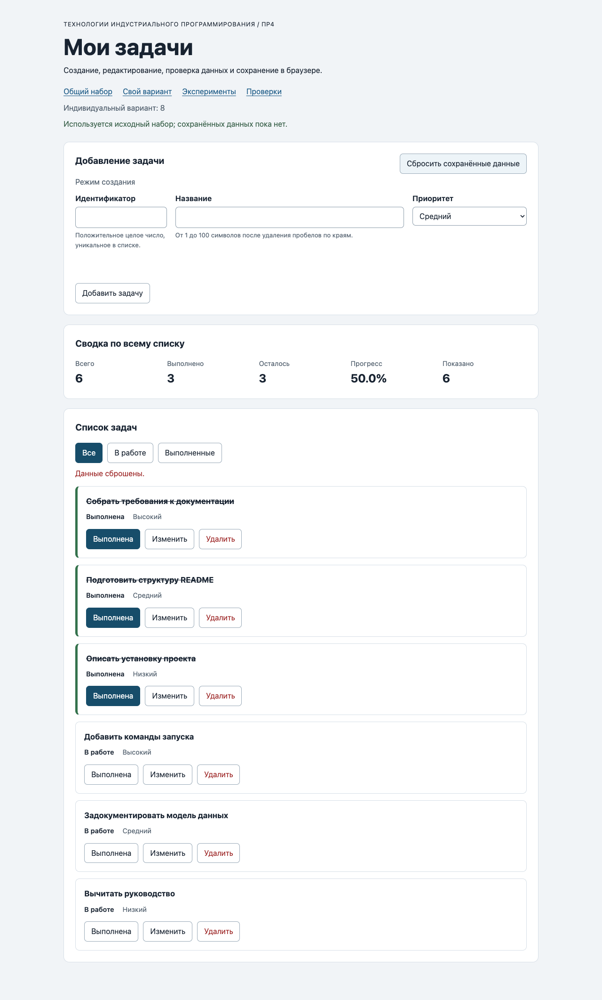

# Практическая работа № 4. Формы, валидация и локальное хранение данных

## Данные работы

| Поле | Значение |
|---|---|
| Имя | Куницкий Алексей |
| Группа | ЭФБО-05-25 |
| Номер в журнале | 16 |
| Вариант из ПР2–ПР3 | 8 |
| Node.js | `v25.2.1` |
| npm | `11.6.2` |
| Git | `2.50.1 (Apple Git-155)` |
| Браузер | Chromium 153.0.8010.12 |
| Операционная система | macOS 27.0 (26A428) |
| Дата проверки | 06.10.2026 |

Задание: [методичка ПР4](https://github.com/adyshkins/TIP-JS/tree/main/practices/practice-04).
В методичке рекомендован Node.js 24; фактический запуск выполнен на имеющемся Node.js 25.2.1.

## Запуск

Команды выполняются из папки `practice-04`:

```bash
npm test
npm start
```

Зависимостей нет; `npm install` не требуется. Адреса:

```text
http://127.0.0.1:5504/
http://127.0.0.1:5504/index.html?dataset=variant
http://127.0.0.1:5504/examples/forms-storage.html
http://127.0.0.1:5504/checks.html
```

Если порт занят: `node tools/serve.mjs 5505`. Другой порт означает отдельное хранилище браузера.

## Перенос ПР3

| Файл | Что перенесено или изменено |
|---|---|
| `data.js` | Общий набор и шесть задач варианта 8 без изменения исходных данных. |
| `task-service.js` | Все девять функций ПР2; добавлена `updateTask`, сохраняющая статус. |
| `task-selectors.js` | Три фильтра ПР3 без изменения реализации. |
| `task-view.js` | Карточки, сводка и пустые состояния ПР3; добавлена кнопка `edit`. |

Повторный запуск прежних проверок сервиса дал 35 пройденных сценариев, 0 ошибок.
Предыдущие практики сохранены в отдельных папках.

## Эксперименты с формой и JSON

| № | Прогноз | Фактический результат | Объяснение |
|---:|---|---|---|
| 1. Пустое название | Браузер не вызовет `submit`. | `validity.valid = false`; журнал остался «Действия ещё не выполнялись». | Ограничение `required` проверяется до обработчика отправки. |
| 2. Название из пробелов | Нативная проверка пропустит, прикладная отклонит. | «Название не должно состоять только из пробелов.»; журнал сообщил об отказе прикладной проверки. | После `trim` название пустое; `setCustomValidity` делает поле невалидным. |
| 3. Корректный ввод | Поля будут строками, отправка отменится. | `defaultPrevented: true`; тип названия — `string`; `  Новая задача  ` нормализовано до `Новая задача`. | `FormData` возвращает строки; `preventDefault` отменяет переход страницы. |
| 4. Чтение записи | `getItem` вернёт строку, `JSON.parse` — объект. | Сохранено `{"title":"Новая задача","priority":"high"}`; прочитан объект с теми же полями. | Хранилище сохраняет JSON как строку. |
| 5. Повреждённый JSON | Разбор завершится ошибкой, страница продолжит работать. | Для `{broken-json` журнал вывел `JSON.parse завершился ошибкой` и `Expected property name or '}' in JSON at position 1`. | Исключение перехвачено в `try/catch`. |

## Организация кода

`task-service.js` выполняет операции над массивом без его изменения. `form-validation.js` проверяет и нормализует черновик без DOM. `task-storage.js` проверяет полную схему, версию и уникальность id, выполняет JSON-преобразования и перехватывает ошибки хранилища. `task-view.js` создаёт элементы и безопасно выводит названия через `textContent`. `main.js` хранит текущее состояние, режим формы и связывает события с сервисом, сохранением и отрисовкой.

Объект `storage` передаётся аргументом, чтобы модуль не зависел от глобального браузерного объекта и позволял воспроизвести ошибки чтения, записи и удаления. Успешный `JSON.parse` не подтверждает правильность полей, поэтому сохранённый список проверяется целиком. Некорректная запись приводит к исходному набору с предупреждением.

После `add`, `update`, `toggle` и `delete` сохраняется новый массив. Фильтр, начало редактирования и `renderApp` не записывают данные. При ошибке записи изменения остаются в памяти вкладки, а сообщение предупреждает о возможной потере после перезагрузки.

## Проверка формы

| Сценарий | Ожидание | Фактический результат | Итог |
|---|---|---|---|
| Корректная задача | Добавление и сохранение | `id=20` добавлен; название очищено по краям; запись содержит новую задачу. | Пройдено |
| Повторный id | Отказ без изменения данных | Ошибка около id; строка storage и список не изменились. | Пройдено |
| Пустая форма | Нативный отказ | Поле id невалидно, новой записи нет. | Пройдено |
| Название из пробелов | Прикладной отказ | Ошибка около названия, список не изменился. | Пройдено |
| Название длиной 100 | Успех | Добавлена задача с названием из 100 символов. | Пройдено |
| Название длиной 101 | Отказ | Ошибка длины; ранее сохранённая строка не изменилась. | Пройдено |
| Изменение title и priority | Статус сохраняется | Выполненная задача `1` после изменения осталась выполненной. | Пройдено |
| Отмена редактирования | Пустая форма создания | id снова доступен, поля очищены, фокус на id. | Пройдено |
| Несколько ошибок | Исправление одного поля сохраняет другую ошибку | После исправления повторного id ошибка пробельного названия осталась. | Пройдено |

## Общий сценарий

Ожидания для каждого шага взяты из раздела 6.8 методички. Фактические значения совпали.

| Шаг | Действие | Видимые id | Всего | Выполнено | Осталось | Прогресс | Storage |
|---:|---|---|---:|---:|---:|---|---|
| 0 | Исходный набор после сброса | `[1, 4, 7, 10]` | 4 | 2 | 2 | 50.0% | Ключ отсутствует |
| 1 | Добавить 20: Изучить localStorage, high | `[1, 4, 7, 10, 20]` | 5 | 2 | 3 | 40.0% | JSON версии 1 |
| 2 | Повторный id=4: отказ | `[1, 4, 7, 10, 20]` | 5 | 2 | 3 | 40.0% | Строка не изменилась |
| 3 | Изменить 4: Подготовить форму задач, low | `[1, 4, 7, 10, 20]` | 5 | 2 | 3 | 40.0% | JSON версии 1 |
| 4 | Выполнить 7 | `[1, 4, 7, 10, 20]` | 5 | 3 | 2 | 60.0% | JSON версии 1 |
| 5 | Удалить 1 | `[4, 7, 10, 20]` | 4 | 2 | 2 | 50.0% | JSON версии 1 |
| 6 | Перезагрузить | `[4, 7, 10, 20]` | 4 | 2 | 2 | 50.0% | JSON версии 1 |
| 7 | Сбросить | `[1, 4, 7, 10]` | 4 | 2 | 2 | 50.0% | Ключ отсутствует |

На шаге 3 статус задачи `4` остался `false`. После перезагрузки показано сообщение «Данные восстановлены из localStorage.». После сброса текущий ключ отсутствует.

## Восстановление и ошибки хранилища

| Случай | Ожидание | Фактический результат | Итог |
|---|---|---|---|
| Ключ отсутствует | Независимая копия исходного набора | `source: initial`, новый массив и новые объекты. | Пройдено |
| Корректная запись | Восстановление после перезагрузки | Сохранились `[4, 7, 10, 20]` и `50.0%`. | Пройдено |
| Повреждённый JSON | Исходный набор и предупреждение | Приложение запустилось с `[1, 4, 7, 10]`, сообщение отмечено как предупреждение. | Пройдено |
| Неверная схема или версия | Отказ от всей записи | Неверный boolean и `version: 999` привели к исходному набору и предупреждению. | Пройдено |
| Сброс | Удаляется только текущий ключ | Ключ отсутствует; посторонний ключ сохранён в модульной проверке. | Пройдено |
| Разные наборы | Изменения не смешиваются | Общий набор остался `[1, 4, 7, 10]` после изменения варианта. | Пройдено |
| Ошибки методов storage | Управляемый отказ | Ошибки `getItem`, `setItem` и `removeItem` перехвачены. | Пройдено |

Основные ключи: `tip-js-practice-04:demo` и `tip-js-practice-04:variant`. Проверки используют отдельные `tip-js-practice-04:checks:*`. `localStorage.clear()` не используется.

## Индивидуальный вариант

Вариант 8: оформление технической документации. Исходные id — `[11, 23, 37, 41, 58, 64]`, первые три задачи выполнены.

Добавлена `75`: «Добавить описание установки», `medium`. Задача `23` переименована в «Проверить техническое описание», приоритет — `high`, статус остался `true`. Затем удалена выполненная задача `37`.

| Этап | Всего | Выполнено | Осталось | Прогресс | Видимые id |
|---|---:|---:|---:|---|---|
| Исходный набор | 6 | 3 | 3 | 50.0% | `[11, 23, 37, 41, 58, 64]` |
| Добавление 75 | 7 | 3 | 4 | 42.9% | `[11, 23, 37, 41, 58, 64, 75]` |
| Редактирование 23 | 7 | 3 | 4 | 42.9% | `[11, 23, 37, 41, 58, 64, 75]` |
| Удаление 37 | 6 | 2 | 4 | 33.3% | `[11, 23, 41, 58, 64, 75]` |
| Перезагрузка | 6 | 2 | 4 | 33.3% | `[11, 23, 41, 58, 64, 75]` |
| Сброс | 6 | 3 | 3 | 50.0% | `[11, 23, 37, 41, 58, 64]` |

Общий набор после этих действий не изменился. После сброса варианта вернулись исходные шесть задач.

## Протокол сервиса

Фактический итог запуска `checks/service.checks.js`:

```text
Проверок пройдено: 35; не пройдено: 0.
```

## Протокол новых модулей

Фактический итог запуска `checks/modules.checks.js`:

```text
Проверок пройдено: 27; не пройдено: 0.
```

## Протокол браузерных проверок

Фактический текст страницы `checks.html`:

```text
OK: Фильтры ПР3 сохраняют порядок и не изменяют вход
OK: Карточка содержит toggle, edit и delete
OK: Название задачи выводится как текст
OK: Повторная отрисовка списка не накапливает карточки
OK: Сводка использует полный список и отдельный visibleCount
OK: Пустые состояния различают список и фильтр
OK: Приложение запускается с исходным набором
OK: Корректная форма добавляет задачу и сохраняет данные
OK: Повторяющийся id отклоняется без записи
OK: Название из пробелов отклоняется прикладной проверкой
OK: Нативные ограничения не пропускают пустую форму
OK: Кнопка edit заполняет форму и блокирует id
OK: Редактирование меняет title и priority, сохраняя completed
OK: Отмена редактирования возвращает режим создания
OK: Успешная отправка очищает ошибки и форму
OK: Изменение статуса сохраняется
OK: Удаление сохраняется
OK: Фильтр не записывается, но сохраняется после изменения данных
OK: Перезагрузка восстанавливает сохранённые задачи
OK: Сброс удаляет ключ и восстанавливает исходный набор
OK: Повреждённый JSON не ломает запуск
OK: Некорректная схема из storage заменяется исходным набором
OK: Общий и индивидуальный наборы используют разные ключи
Всего: 23. Пройдено: 23. Ошибок: 0.
```

## Собственные проверки

| № | Исходное состояние и действия | Ожидание | Фактический результат | Итог |
|---:|---|---|---|---|
| 1 | Добавить название длиной 100; затем программно задать 101 символ для новой задачи. | Первая задача добавится, вторая отклонится. | Добавлен `20`; для `21` появилась ошибка длины, JSON не изменился. | Пройдено |
| 2 | Удалить все четыре исходные задачи и перезагрузить. | Пустой список восстановится, исходные задачи не появятся. | JSON `{"version":1,"tasks":[]}`; `0 / 0 / 0 / 0.0%`; «Список задач пуст.». | Пройдено |
| 3 | Записать `{"version":999,"tasks":[]}` и перезагрузить. | Неизвестная версия отклонится. | Восстановлен исходный набор; «Неверная версия или структура сохранённых задач.». | Пройдено |
| 4 | Запретить `setItem` в тестовой вкладке и добавить задачу. | Изменение останется в памяти с предупреждением. | Задача `20` видна; сообщение предупреждает, что изменения не сохранены и могут потеряться. | Пройдено |

## Клавиатура и отладка

Отправка формы клавишей Enter добавила задачу `20` без перезагрузки. Enter на `edit` перевёл фокус в название. Space на отмене вернул фокус на id; следующий Tab перешёл к названию. При удалении редактируемой задачи форма вышла из режима редактирования. Неизвестные действия и id `777` и `4abc` не создали запись в хранилище.

При редактировании `FormData.get("id")` фактически вернул `null`, поэтому id берётся из `editingId`. В общем сценарии после сохранения название `4` стало «Подготовить форму задач», приоритет — `low`, статус — `false`; JSON содержал те же значения.

Остановка в DevTools на точке внутри `handleFormSubmit` пока не выполнена. Для неё нужно показать сырой `draft`, `validated`, `result` и строку JSON, а затем повторить отказ для занятого id. Результаты запуска интерфейса не заменяют этот пункт отладки.

## Вид приложения

Снимок получен после запуска индивидуального варианта:



## Дополнительное задание

Не выполнялось.

## Вывод

В приложение добавлены создание и редактирование задач, проверка полей и сохранение изменений между перезагрузками. HTML отсеивает базовые ошибки ввода, прикладная валидация проверяет правила задачи, а модуль хранения отдельно проверяет прочитанный JSON. Ошибки storage выводятся пользователю и не прерывают работу текущей вкладки.
